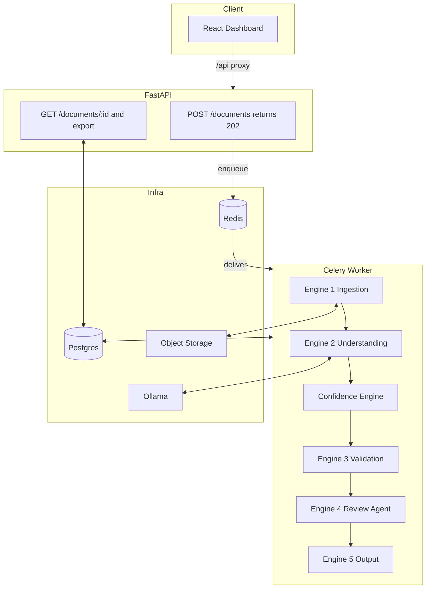

# DocIntel - Agentic Document Intelligence Platform

DocIntel ingests enterprise documents (invoices today; the architecture is
plugin-based for any document type), extracts structured data with a local LLM,
independently **verifies** that extraction, validates it against configurable
business rules, and routes anything uncertain through an **AI review agent** that
decides Accept / Retry / Escalate / Reject — then exports the result in multiple
formats. It is built the way a production AI team builds a system: async by
necessity, plugin-based for extensibility, and designed around the assumption
that the model will sometimes be wrong or actively attacked.

The core thesis of the system: **don't trust the AI — verify it.** Every LLM
output is checked by deterministic engines that can catch hallucination,
arithmetic manipulation, and prompt injection, so the system stays correct even
when the model does not.


## What it does (end to end)

1. **Ingest** - a document is uploaded via REST. The API returns `202 Accepted`
   in milliseconds and processing runs asynchronously in a background worker.
2. **Understand** - text is extracted deterministically (PyMuPDF for digital
   PDFs, Tesseract OCR only when needed), then a local LLM (Ollama / qwen2.5)
   extracts structured fields constrained to a schema.
3. **Score confidence** - each field's trustworthiness is computed from
   deterministic signals (is the value present? is it *grounded* in the source
   text? does the date parse? does the arithmetic reconcile?), aggregated with a
   min-gated strategy so a single bad critical field caps the whole document.
4. **Validate** - 18 configurable business rules (arithmetic, dates, duplicates,
   tax, prompt-injection, …) each return PASS / WARNING / FAIL with a suggested fix.
5. **Review** — if confidence is low or validation fails, a LangGraph agent
   inspects the evidence and decides Accept / Retry / Escalate / Reject, bounded
   by deterministic guardrails so it can never loop forever.
6. **Export** — the result is available as JSON, CSV, XML, or XLSX, with an
   optional evidence trail for auditors.

A React dashboard visualizes every stage: upload, a live status list, a document
detail view with per-field confidence and the full validation/review trail, and
a review queue of escalated documents.

---

## Architecture



**Why this shape:** the LLM call takes 6–40 seconds locally, so processing
*cannot* run on the request path — it runs in a Celery worker, and the document's
status enum doubles as a resumable checkpoint. File bytes live in object storage;
Postgres holds only queryable metadata and results. Every engine is a plugin
seam: a new document type, rule, or export format is a new file, not an edit to
existing code.

---

## Key design decisions

Each was made deliberately and is recorded as an ADR in `docs/adr/`.

**Async via Celery + Redis, not RabbitMQ.** A measured 6–40s LLM latency makes
synchronous processing impossible. Redis is already needed; RabbitMQ would be
operational complexity for throughput this project never reaches.

**Confidence is verified, not self-reported.** Small local models over-report
confidence, so field trust is derived from deterministic checks the model cannot
fake — most importantly *grounding*: a value must appear verbatim in the source
text, which catches hallucination without a second model call. Aggregation uses a
**min-gated weighted mean**: weighted overall, but capped by the weakest
*critical* field, so a missing total tanks the document to 0 while a missing
discount barely moves it. Chosen over arithmetic mean (too forgiving) and
geometric mean (punishes trivial fields) for explainability.

**Validation is open/closed by construction.** Rules self-register via a
decorator and the package autoloads every module, so adding a rule is dropping a
file in a folder — the engine never grows an `if/elif` chain. A `SKIPPED`
severity exists because a rule that *couldn't run* must never report PASS.

**The review agent is bounded by construction, not by instruction.** The LLM
*proposes*; deterministic graph edges *dispose*. Retry is unreachable once the
attempt budget is spent or when every failure is blocking (a property of the
document, not the extraction — a duplicate invoice, or a grounded-but-wrong
total). An agent trusted to police its own retry budget will eventually loop
forever; this one cannot.

**Prompt-injection defense lives at the trust boundary.** Sanitization and
detection run *before* the model sees the text, because validation and review run
*after* the injection would already have executed. Defense in depth: schema-
constrained decoding makes format hijacking impossible, arithmetic validation
catches numeric manipulation, and injection-pattern detection flags the rest. A
poisoned invoice fooled the model, and the system still escalated it via two
independent layers.

**Auth fails closed; the rate limiter fails open.** API-key auth (service-to-
service, not JWT — there are no user identities) rejects on failure. The Redis
rate limiter, if Redis is unreachable, lets requests through — a guardrail must
never become the outage it was meant to prevent.

---

## Tech stack

- **Backend:** Python 3.12, FastAPI, Pydantic, SQLAlchemy, Alembic
- **Async:** Celery on Redis
- **Data:** PostgreSQL (metadata + results), object storage (file bytes)
- **AI:** Ollama (qwen2.5:7b) via a swappable `LLMProvider` interface; LangGraph
  for the review agent
- **Extraction:** PyMuPDF (native), Tesseract (OCR)
- **Observability:** structlog, OpenTelemetry traces
- **Frontend:** React + Vite + Tailwind
- **Tests:** 72 tests (pytest)

---

## Running it

Prerequisites: Docker, Python 3.12 + uv, Node 20+, and Ollama with
`qwen2.5:7b-instruct` pulled.

```bash
# 1. infrastructure
docker compose up -d

# 2. backend
cd backend
uv sync
uv run alembic upgrade head
uv run uvicorn app.main:app --reload

# 3. worker (separate terminal)
cd backend
uv run celery -A app.workers.celery_app.celery_app worker --loglevel=info --concurrency=1

# 4. frontend (separate terminal)
cd frontend
npm install
npm run dev
```

Open http://localhost:5173 and upload a document.

---

## Testing

```bash
cd backend
uv run pytest            # 72 tests
uv run ruff check app tests
```

Tests are DB- and network-free by design: services take dependencies via
injection (storage, LLM provider, duplicate lookup, clock), so unit tests use
fakes and never touch Postgres or Ollama.

---

## Project structure

backend/app/
├── api/ # thin routers; orchestrate, never compute
├── core/ # config, logging, security, tracing, rate limiting
├── engines/
│ ├── ingestion/ # Engine 1: normalize to DocumentEnvelope
│ ├── understanding/ # Engine 2: text extraction + LLM providers
│ ├── confidence/ # deterministic scoring + aggregation strategies
│ ├── validation/ # Engine 3: rule registry + rules/
│ ├── review/ # Engine 4: LangGraph agent
│ ├── output/ # Engine 5: exporter registry + exporters/
│ └── security/ # prompt-injection defense
├── plugins/invoice/ # a document type = schema + prompts + rule config
├── models/ # SQLAlchemy (persistence shape)
├── schemas/ # Pydantic (API + LLM contract shape)
└── workers/ # Celery tasks (thin wrappers around engines)


---

## Future improvements

- Additional document types (POs, receipts, KYC) — each a plugin folder.
- Additional LLM providers behind the existing `LLMProvider` interface.
- Learned confidence weights calibrated against human-review outcomes.
- Sliding-window rate limiting for smoother burst handling.
- OTLP export to a real collector (Jaeger/Tempo) — a config change.
